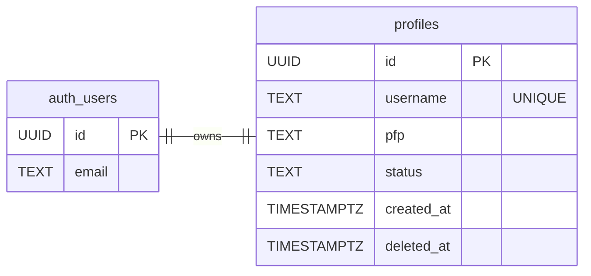

```mermaid
erDiagram
    direction LR
    auth_users {
        UUID id PK
        TEXT email
    }

    profiles {
        UUID id PK
        TEXT username "UNIQUE"
        TEXT pfp
        TEXT status
        TIMESTAMPTZ created_at
        TIMESTAMPTZ deleted_at
    }


    auth_users ||--|| profiles : owns
```
